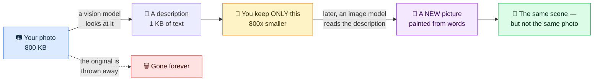
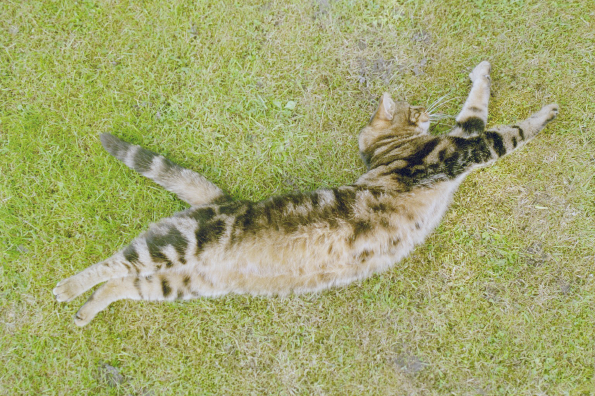
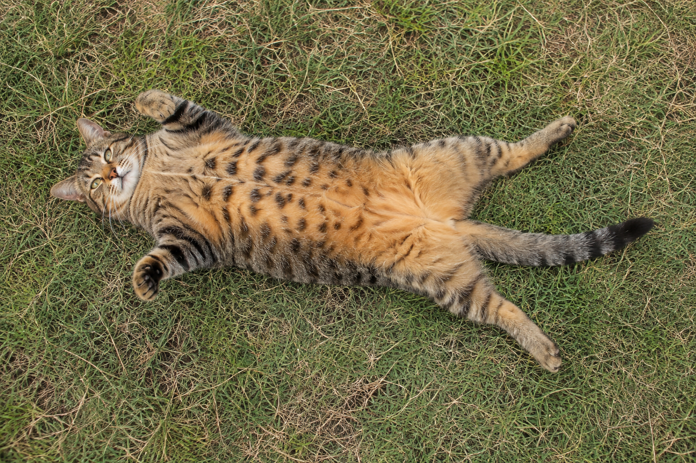

# llmPEG

[](https://github.com/marcelpetrick/llmPEG/actions/workflows/ci.yml)
[](LICENSE)
[](https://www.python.org/)
[](https://docs.astral.sh/ruff/)
[](https://mypy-lang.org/)
[](#development)

**llmPEG** — the *LLM Photo Expert Group*. JPEG was built by the **J**oint **P**hotographic
**E**xperts **G**roup. This one was built by a language model, so the joke writes itself.

The joke is the point. A meme goes around every few months: *"I compressed my family photos into
an AI prompt and deleted the originals — 6 MB down to 200 bytes!"* It is satire. Deletion has been
renamed compression. Everybody laughs.

llmPEG is that joke, built for real and measured honestly. A vision model turns your image into a
small text description. Later, an image generator reads that description and paints a **brand new
picture**. The original is gone. What comes back is not your photo — it is a stranger's photo of
the same idea.

**Author: Marcel Petrick <mail@marcelpetrick.it>**

**Note: project is generated with AI.**

**License: GPLv3 or later. See `LICENSE`.**

> ## ⚠️ This is TOTALLY LOSSY
>
> llmPEG does not preserve pixels. It does not preserve faces, text, brands, or how many things
> were in the picture. It throws the image away and keeps a caption.
>
> Never use it for archives, evidence, medical images, identity documents, irreplaceable family
> photos, or anything you cannot afford to lose. It is not a backup. It is not JPEG. It is an
> experiment about how much meaning survives when you delete everything else.

## How it works, for non-technical readers



Think of it as describing a painting to a friend over the phone, throwing the painting away, and
years later asking a different artist to paint it back from your description. You get *a*
painting. You do not get *your* painting.

There is no decompressor. "Decompression" here means an image generator inventing a new picture
from text — which is why everything below is scored rather than trusted.

## Try it on your own photo

[`prototypeWebUI/`](prototypeWebUI/README.md) is a small local web page: drop an image, watch the
vision model describe it, read the description, then have a **free** image generator paint a new
picture from those words alone.

```bash
export OLLAMA_VISION_HOST=http://your-ollama-host:11434
uv run python prototypeWebUI/server.py     # then open http://127.0.0.1:8000
```

Generation defaults to [Pollinations](https://pollinations.ai/) — no API key, no account, no
credits — and an Automatic1111-compatible local Stable Diffusion path is available for keeping
prompts on your own hardware. The prompt is editable before you generate, which is the one real
perk of a codec whose compressed form is readable.

Doing this to a photo you took yourself makes the point faster than any table below.

## The cat, the ratio, and the catch

| Source photo | Prompt-only reconstruction |
| --- | --- |
|  |  |

| Measurement | Result |
| --- | ---: |
| Source JPEG | 799,983 bytes |
| Semantic artifact | 997 bytes |
| **Compression ratio** | **802:1** |
| Size reduction | 99.88% |
| Visual proxy score | 0.595 (pass, `balanced`) |
| Layout score | 0.706 (pass) |
| dHash similarity | 0.500 |

**802:1.** That is the whole seduction of the idea, and it is real — 997 bytes of text stood in
for an 800 KB photograph, and what comes back is unmistakably a cat stretched out on grass.

Now the catch: it is **not the same cat**. The markings are invented, the pose is approximate, the
fur is a different fur. And this is the *lowest* visual-proxy score of the three cats tested — the
best ratio in this repository buys the weakest resemblance. That trade-off is the finding, not a
footnote.

## The hard case: a page of text

| Source | Prompt-only reconstruction |
| --- | --- |
|  |  |

The satirical article that inspired the project is also the cruelest test for it, because its
meaning *is* its text. Generated from [the rendered prompt](examples/news-article.prompt.txt)
alone — the generator never saw the source.

| Measurement | Result |
| --- | ---: |
| Source JPEG | 123,585 bytes |
| Semantic artifact | 3,334 bytes |
| Size reduction | 97.30% (37:1) |
| Visual proxy score | 0.770 (pass) |
| Layout score | 0.812 (pass) |
| Palette distance | 0.059 (pass; lower is better) |
| Critical-text recall | 0.600 (**fail**) |
| `detailed` profile verdict | **fail** |

That last row matters most. The output kept the masthead, headline, article grid, boy with laptop,
crying family, and palette — then invented new body copy. It is a good semantic reconstruction and
a bad copy of a document. The checked-in
[evaluation report](examples/news-article.evaluation.json) records both facts, and this demo stays
in the README **because** it fails.

The reconstruction PNG is 1.88 MB — larger than the input JPEG. The storage win exists only while
you keep the artifact and regenerate on demand; model weights and compute are not free.

## Benchmarks

### Cat survey (`n=3`, `balanced`)

Open [`survey/index.html`](survey/index.html) for interactive comparisons with machine metrics,
exact prompts, source/license links, 1–5 human-rating controls, and JSON export.

| Aggregate | Result |
| --- | ---: |
| Cases passing proxy thresholds | 3/3 |
| Mean visual proxy | 0.667 |
| Mean layout score | 0.686 |
| Mean palette distance | 0.081 |
| Mean dHash similarity | 0.474 |

The codec reliably preserved "what kind of cat is doing what, where?" It did not preserve the same
cat, exact markings, fur texture, or pixels.

The [detailed identity survey](survey/detailed.html) repeats the experiment with 2.3–3.0 KB
artifacts carrying subject bounds, pose landmarks, marking boundaries, and camera geometry. It
improves two visual-proxy scores and slightly lowers one — extra detail helps selectively rather
than guaranteeing identity.

### Expanded scene benchmark (`n=10`, `detailed`) — complete

Harder question: what survives in a busy scene full of people, objects, and signage? Ten complex
sources, all reconstructed from their prompts alone and evaluated. Per-case table in
[`survey/EXPANDED.md`](survey/EXPANDED.md), visuals in
[`survey/expanded.html`](survey/expanded.html).

| Aggregate | Result |
| --- | ---: |
| Cases measured | 10 of 10 |
| Passing all thresholds | 9 |
| Failing a threshold | 1 (crew portrait, on text recall) |
| Mean visual proxy | 0.737 |
| Mean layout score | 0.746 |
| Mean palette distance | 0.069 |
| Mean critical-text recall | 0.950 |

**Text survived far better than expected.** Nine of ten cases recalled every critical string — one
reconstruction rendered a Japanese platform sign, `山手線 / Yamanote Line / 東京・上野・駒込方面`,
correctly from the description alone.

**Identity still did not.** The single failure is the one that depends on *who* is in the frame:
the six-person astronaut crew portrait recalled half its text and invented the rest, turning six
specific people into six plausible ones. More cases did not soften that.

Two caveats on the 0.950: recall does not punish *invented* text (one reconstruction adds a
fictional bike number and still scores 1.00), and duplicate expected strings all match a single
rendered occurrence. Both are documented in `EXPANDED.md`.

### What a full cycle costs

Measured by [`scripts/benchmark_cycle.py`](scripts/benchmark_cycle.py) against a local
`qwen3-vl:32b-ctx49k` endpoint — three images, two runs each, `balanced` profile. Raw data in
[`docs/benchmark-cycle.json`](docs/benchmark-cycle.json).

| Stage | Mean | Range |
| --- | ---: | ---: |
| **Compress** (image → artifact) | 78.0 s | 63.5 – 104.7 s |
| **Render prompt** (artifact → generator prompt) | < 1 ms | — |
| **Evaluate** (source vs reconstruction) | 0.12 s | 0.11 – 0.13 s |
| **Decompress** (prompt → new image) | not measured | external generator |

The cost is wildly asymmetric. Compressing one photograph costs over a minute of GPU time;
everything llmPEG itself does afterwards is effectively free. And the expensive half —
regenerating the picture — is not even in this codebase, because llmPEG ships no generator. A
codec whose decompressor is "rent a diffusion model" has an honesty problem with the word
*compression*, which is the joke.

**Reproducibility is worse than the ratio suggests.** Re-encoding `cat-on-grass` for this
benchmark produced a **1,275-byte** artifact where the checked-in run produced **997 bytes** —
627:1 instead of 802:1, from the same image, the same model name, the same seed `42` and
temperature `0`. The compression ratio is not a property of your photo. It is a property of one
particular run of one particular model, and it moves by 28% between runs.

### Does the score match a human eye? We still cannot say.

A vision-model judge rated every checked-in pair on scene, identity, composition, mood, and an
overall "is this a faithful stand-in?".

An earlier version of this README reported that `visual_proxy_score` correlates **−0.468** with
that judge — that the headline metric pointed the wrong way. **That claim is withdrawn.** A second
run, differing only by a formatting instruction added to the judge's prompt, changed **11 of 12
verdicts by an average of 1.67 points** on a 1–5 scale, at temperature 0 with a fixed seed. The
correlation moved with them:

| Metric | ρ, run 1 (n=12) | ρ, run 2 (n=16) |
| --- | ---: | ---: |
| **`visual_proxy_score`** | **−0.468** | **+0.007** |
| `edge_similarity` | −0.392 | +0.389 |
| `palette_distance` (inverted) | −0.725 | +0.287 |

Every correlation flipped sign or collapsed. The finding is therefore not about the metrics at
all: **a single-run vision-model judge is not a stable enough instrument to validate them.** Both
runs are checked in so the flip can be recomputed rather than believed.

What survives: `aspect_similarity` is degenerate in both runs (σ ≈ 0.004), and the structural
signals remain blind to subject identity by construction — edges and histograms cannot encode
*who* is in a photograph. Treat `visual_proxy_score` as a structural sanity check, not a quality
score. Full analysis, both datasets, and what would actually settle the question in
[`docs/metrics.md`](docs/metrics.md).

### Can the codec improve itself? Not yet.

[`scripts/adversarial_refine.py`](scripts/adversarial_refine.py) runs a GAN-*shaped* loop — no
gradients, no trained discriminator, just the useful part of the idea: the extraction instruction
proposes, a critic that sees the original and only the generated prompt attacks, and its
complaints steer the next round.

| Round | Mean reconstructability | Severe misses | Mean artifact bytes |
| ---: | ---: | ---: | ---: |
| 0 (baseline) | 3.00 | 6 | 2,767 |
| 1 | 3.00 | 10 | 2,408 |
| 2 | 3.00 | 10 | 2,418 |

It failed, and the failure is the useful part: **the critic returned exactly 3 for all nine
case-rounds.** A discriminator with no dynamic range provides no gradient, so nothing downstream
could work. Told to prioritise counts and positions, the encoder produced *smaller* artifacts with
*more* severe misses — focus instructions compete for a fixed byte budget, and nothing decided
what was safe to drop. Diagnosis and the fix worth trying next (pairwise forced choice instead of
absolute scoring) in [`docs/adversarial.md`](docs/adversarial.md).

Regenerate any survey page after changing a manifest or result:

```bash
uv run llmpeg survey survey/manifest.json --output survey/index.html --overwrite
uv run llmpeg survey survey/detailed-manifest.json --output survey/detailed.html --overwrite
uv run llmpeg survey survey/expanded-manifest.json --output survey/expanded.html --overwrite
```

## Media and licensing

**Every benchmark and survey image in this repository is freely licensed media from Wikimedia
Commons** — CC0 1.0 or public domain — with attribution read from each file's own Commons record
rather than assumed:

| Set | Images | Licensing |
| --- | ---: | --- |
| Cat survey | 3 | Public domain dedication — [per-case credits](survey/README.md) |
| Expanded scene benchmark | 10 (8 traced, 2 unverified) | CC0 1.0 and NASA public domain — [per-case credits](survey/EXPANDED.md#sources-and-licensing) |

Sources are stored unmodified apart from being resized to at most 1920 px on the longest edge, and
every artifact embeds its source's SHA-256 hash.

Two expanded-benchmark sources (`kitchen-table`, `living-room`) have **no traced Commons record**.
Their URLs were never recorded, and three search passes verified by perceptual hash failed to find
them, so they are labelled unverified in the gallery rather than credited on a guess. They must be
traced before this benchmark is published anywhere that asserts licensing.

One further exception, stated plainly: `media/newsArticle.jpg` is **not** free-licensed media. It is the
third-party satirical image that motivated the project, reproduced here for commentary and as a
deliberately difficult test case. It is not part of the licensed benchmark set.

## Architecture

See the [styled C4 architecture guide](docs/architecture.md) for system-context, container,
component, and reconstruction-lifecycle diagrams.

```text
image ──vision model──> versioned .llmpeg.json ──prompt renderer──> generator prompt
  │                                                                  │
  └──────────────────── evaluation harness <──new image───────────────┘
```

The artifact holds source dimensions and hash, a fidelity profile, generation prompt, critical
text, composition regions, palette, style, avoid-list, and encoder provenance. It never contains
the original image bytes. JSON is serialized canonically, byte budgets are enforced, and source
files are never modified or deleted.

## Quick start

llmPEG needs Python 3.14+ and [uv](https://docs.astral.sh/uv/). Dependencies are pinned in
`uv.lock`.

```bash
uv sync --extra dev
uv run llmpeg --help
```

Encode with an Ollama vision server:

```bash
export OLLAMA_VISION_HOST=http://your-ollama-server:11434
uv run llmpeg encode photo.jpg --profile balanced --output photo.llmpeg.json
```

The default model is `qwen3-vl:32b-ctx49k`. The client uses Ollama's `/api/chat`, structured
output, temperature `0`, seed `42`, and `/no_think`. Ollama 0.32 with this Qwen build sometimes
places valid schema-constrained JSON in `message.thinking` despite `think:false`; llmPEG accepts
that field only when it parses as complete valid JSON. It fails closed on empty, truncated,
malformed, or over-budget output.

Render a generator-neutral prompt, then feed it to the image generator of your choice:

```bash
uv run llmpeg reconstruct photo.llmpeg.json --output photo.prompt.txt
```

Codex's built-in image generation produced the checked-in demos. llmPEG ships no generator and
does not pretend to.

Inspect the actual size claim, and evaluate a reconstruction:

```bash
uv run llmpeg inspect photo.llmpeg.json

uv run llmpeg evaluate photo.jpg regenerated.png \
  --artifact photo.llmpeg.json \
  --ocr-text regenerated.txt \
  --output evaluation.json
```

Output files are never overwritten unless `--overwrite` is supplied. Encoding sends the full image
to the configured Ollama endpoint, so only use a server you trust.

`evaluate` exits `0` for pass, `1` for threshold failure, `2` for usage/data errors, and `3` when
a required check (normally `detailed`-profile OCR) was not evaluated.

## Fidelity profiles

| Profile | Intended preservation | Artifact budget |
| --- | --- | ---: |
| `gist` | subject, action, setting, palette, broad composition | max(1 KiB, 2% of source) |
| `balanced` | gist plus relationships, lighting, style, major objects, critical text | max(4 KiB, 5%) |
| `detailed` | balanced plus OCR text, attributes, approximate geometry, typography intent | max(16 KiB, 15%) |

If a model response does not fit, encoding **fails** instead of silently dropping content to
improve the ratio.

## What the score means

The offline harness uses Pillow to compare aspect ratio, dHash, RGB histograms, edge density, and
dominant colors, combining them into `visual_proxy_score` and `layout_score`. These are fast
structural proxies — not human judgment, not CLIP similarity, and not proof that two images mean
the same thing. An attempt to validate them against a vision-model judge was inconclusive — the
judge itself proved unstable ([`docs/metrics.md`](docs/metrics.md)) — so read `visual_proxy_score`
as a structural sanity check rather than a quality score. Critical-text recall is scored
separately and reports `not_evaluated` when no transcript is supplied.

The demo transcript was verified by hand because the local Tesseract installation had no language
data. llmPEG consumes OCR text; it does not ship an OCR engine.

## Development

```bash
uv run ruff format --check .
uv run ruff check .
uv run mypy src tests scripts prototypeWebUI
uv run pytest --cov=llmpeg --cov-report=term-missing --cov-fail-under=90
uv run python -m build
```

The suite is offline and injects fake providers. Live Ollama and image-generation runs are manual
demo steps, not CI dependencies. Current suite: **47 tests, 93.4% branch-aware coverage**.

[`.github/workflows/ci.yml`](.github/workflows/ci.yml) runs all five gates on Python 3.14 for
every push and pull request.

See [AGENTS.md](AGENTS.md) for the contributor working agreement, including the Conventional
Commits requirement.

## Limitations

- Regeneration is non-deterministic and depends on provider, model version, seed, settings, and
  service availability.
- Faces, identity, exact poses, text, type metrics, fine texture, and small objects change.
- Prompts can preserve private facts even though they are smaller than images.
- A compact artifact can exceed a tiny or already well-compressed source.
- Evaluation proxies can be fooled and cannot establish evidentiary equivalence.
- Generator compute and model weights dwarf the artifact; this is a storage experiment, not a
  claim about total-system efficiency.

Inspired by [this LinkedIn post](https://lnkd.in/p/eSqXmyvw) and the satirical
["New Compression Technique"](https://programmerhumor.io/ai-memes/new-compression-technique-9yp7)
article. See [vision.md](vision.md) for the product contract and [plan.md](plan.md) for the
delivery plan.

Licensed under the [GNU General Public License v3.0 or later](LICENSE).
