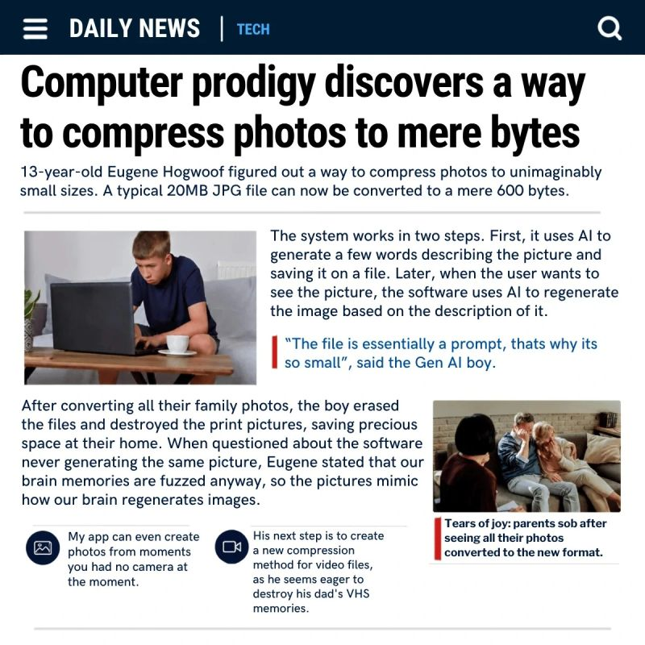
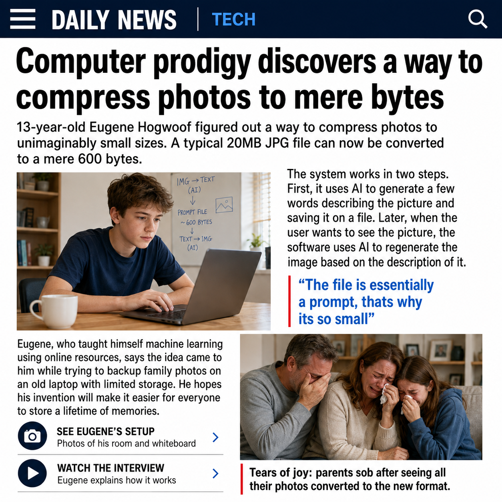

# PromptPress

PromptPress is an experimental **semantic image codec**: a vision model turns an image into a
small, versioned description; an image model later renders a new image from that description.

It is also a test of where that idea breaks.

> PromptPress does not preserve pixels. It throws away the original visual data and keeps a
> structured caption. Never use it for archives, evidence, medical images, identity documents, or
> anything you cannot afford to lose.

The project was inspired by [this LinkedIn post](https://lnkd.in/p/eSqXmyvw) and the satirical
[“New Compression Technique”](https://programmerhumor.io/ai-memes/new-compression-technique-9yp7)
article. See [vision.md](vision.md) for the product contract and [plan.md](plan.md) for the delivery
plan.

## The experiment

| Source | Prompt-only reconstruction |
| --- | --- |
|  |  |

The reconstruction was generated by Codex image generation from
[the rendered prompt](examples/news-article.prompt.txt) alone. The generator never received the
source image. The structured
[`.ppress.json` artifact](examples/news-article.ppress.json) came from the local Qwen3-VL model
behind the machine’s `claude-vision` setup.

| Measurement | Result |
| --- | ---: |
| Source JPEG | 123,585 bytes |
| Semantic artifact | 3,334 bytes |
| Artifact/source ratio | 2.70% |
| Size reduction | 97.30% (37.07:1) |
| Visual proxy score | 0.770 (pass) |
| Layout score | 0.812 (pass) |
| Palette distance | 0.047 (pass; lower is better) |
| Critical-text recall | 0.600 (**fail**) |
| Detailed-profile verdict | **fail** |

That last row matters most. The output kept the masthead, headline, article grid, boy with laptop,
crying family, and visual palette. It invented new lower-body copy and changed callouts. It is a
good semantic reconstruction and a bad copy of the original document. The checked-in
[evaluation report](examples/news-article.evaluation.json) records both facts.

The reconstruction PNG is 1.88 MB, larger than the input JPEG. The storage claim applies only
while retaining the artifact and regenerating on demand; compute cost, model storage, and service
availability are not free.

## How it works

```text
image ──vision model──> versioned .ppress.json ──prompt renderer──> generator prompt
  │                                                                  │
  └──────────────────── evaluation harness <──new image───────────────┘
```

The artifact contains source dimensions and hash, a fidelity profile, generation prompt, critical
text, composition regions, palette, style, avoid-list, and encoder provenance. It never contains
the original image bytes. JSON is serialized canonically, byte budgets are enforced, and source
files are never modified or deleted.

## Quick start

PromptPress needs Python 3.11+ and [uv](https://docs.astral.sh/uv/). Dependencies are pinned in
`uv.lock`.

```bash
uv sync --extra dev
uv run promptpress --help
```

Encode with an Ollama vision server:

```bash
export OLLAMA_VISION_HOST=http://your-ollama-server:11434
uv run promptpress encode photo.jpg \
  --profile balanced \
  --output photo.ppress.json
```

The default model is `qwen3-vl:32b-ctx49k`, matching the local `claude-vision` function found in
this project’s development environment. The client uses Ollama’s `/api/chat`, structured output,
temperature `0`, seed `42`, and `/no_think`. Ollama 0.32 with this Qwen build sometimes places
valid schema-constrained JSON in `message.thinking` despite `think:false`; PromptPress accepts that
field only when it parses as complete valid JSON. It fails closed on empty, truncated, malformed,
or over-budget output.

Render a generator-neutral prompt:

```bash
uv run promptpress reconstruct photo.ppress.json --output photo.prompt.txt
```

Send that prompt to the image generator of your choice. Codex’s built-in image generation was used
for the checked-in demo, but it is intentionally not disguised as a Python API.

Inspect the actual size claim:

```bash
uv run promptpress inspect photo.ppress.json
```

Evaluate a reconstruction, optionally supplying OCR/transcribed output for critical-text recall:

```bash
uv run promptpress evaluate photo.jpg regenerated.png \
  --artifact photo.ppress.json \
  --ocr-text regenerated.txt \
  --output evaluation.json
```

Output files are never overwritten unless `--overwrite` is supplied. Encoding sends the full image
to the configured Ollama endpoint, so only use a server you trust.

## Fidelity profiles

| Profile | Intended preservation | Artifact budget |
| --- | --- | ---: |
| `gist` | subject, action, setting, palette, broad composition | max(1 KiB, 2% of source) |
| `balanced` | gist plus relationships, lighting, style, major objects, critical text | max(4 KiB, 5%) |
| `detailed` | balanced plus OCR text, attributes, approximate geometry, typography intent | max(16 KiB, 15%) |

If a model response does not fit, encoding fails instead of silently dropping content to improve
the ratio.

## What the score means

The offline harness uses Pillow to compare aspect ratio, dHash, RGB histograms, edge density, and
dominant colors. It combines those signals into `visual_proxy_score` and `layout_score`. These are
fast structural proxies—not human judgment, CLIP similarity, or proof that two images mean the
same thing. Critical-text recall is scored separately and is `not_evaluated` when no transcript is
provided.

The demo transcript was manually verified because the local Tesseract installation had no
language data. This limitation is explicit: PromptPress consumes OCR text but does not pretend to
ship an OCR engine.

## Development

```bash
uv run ruff format --check .
uv run ruff check .
uv run mypy src tests
uv run pytest --cov=promptpress --cov-report=term-missing --cov-fail-under=90
uv run python -m build
```

The suite is offline and injects fake providers. Live Ollama and image-generation runs are demo
steps, not flaky CI dependencies. The current suite has 30 tests and 96%+ branch-aware coverage.

## Limitations

- Regeneration is non-deterministic and depends on provider, model version, seed, settings, and
  service availability.
- Faces, identity, exact poses, text, type metrics, fine texture, and small objects can change.
- Prompts can preserve private facts even though they are smaller than images.
- A compact artifact can exceed a tiny or already well-compressed source.
- Evaluation proxies can be fooled and cannot establish evidentiary equivalence.
- Generator compute and model weights dwarf the artifact; this is a storage experiment, not a
  claim about total-system efficiency.

Licensed under the [MIT License](LICENSE).

