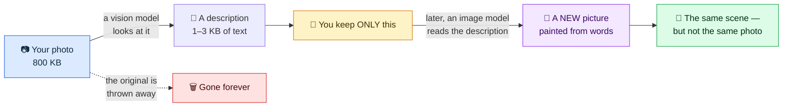

# llmPEG

[](https://github.com/marcelpetrick/llmPEG/actions/workflows/ci.yml)
[](https://github.com/marcelpetrick/llmPEG/actions/workflows/release.yml)
[](https://marcelpetrick.github.io/llmPEG/)
[](https://github.com/marcelpetrick/llmPEG/releases/latest)
[](LICENSE)
[](https://www.python.org/)
[](https://docs.astral.sh/uv/)
[](https://docs.astral.sh/ruff/)
[](https://mypy-lang.org/)
[](#development)
[](https://ollama.com/)
[](https://github.com/QwenLM/Qwen-Image-2.1)

**llmPEG** — the *LLM Photo Expert Group*, after JPEG's **J**oint **P**hotographic **E**xperts
**G**roup. In JPEG the codec is an algorithm. Here it is two models: one writes a tiny description
of your photo, the other paints a new picture from that description.

It started as a joke. A satirical article does the rounds every few months: *"teenager compresses
family photos into AI prompts and deletes the originals, 6 MB down to 200 bytes!"* Deletion,
renamed compression. llmPEG builds that joke for real and measures it honestly.

**Author:** Marcel Petrick <mail@marcelpetrick.it> · **Note:** this project is generated with AI.
· **License:** GPLv3 or later.

> ## ⚠️ This is TOTALLY LOSSY
>
> llmPEG keeps no pixels. It does not preserve faces, text, brands, or how many things were in the
> picture. It throws the image away and keeps a caption.
>
> Never use it for archives, evidence, medical images, identity documents, family photos, or
> anything you cannot afford to lose. It is not a backup and it is not JPEG. It is an experiment
> about how much meaning survives when you delete everything else.

## How it works



Think of describing a painting over the phone, burning the painting, and years later asking a
different artist to paint it from your notes. You get *a* painting, not *your* painting. There is
no decompressor: reconstruction means a generator inventing a new image from text, which is why
everything here is measured rather than trusted.

## The pipeline: two local models

| Stage | Runs on | Model |
| --- | --- | --- |
| **Encode** (photo → artifact) | local [Ollama](https://ollama.com/) | `qwen3.5:4b` vision model, temperature 0, seed 42 |
| **Generate** (artifact → new photo) | local [ComfyUI](https://github.com/comfyanonymous/ComfyUI) | Qwen-Image-2.1, bundled workflow, seed 42 |

Both run on one machine with an 8 GB GPU. The generator receives only the rendered text, never the
source image, and there is no hosted fallback: if a local service is down, the command fails.

**This is the way to run llmPEG.** Early experiments used other tools: a larger remote
`qwen3-vl:32b` endpoint for encoding, and Codex's built-in image generation (plus, briefly, other
hosted adapters) for reconstruction. Their results stay in the repository, labelled with that
provenance, but the local pair replaced them because it is:

- **private** — no image leaves the machine, for encoding or generation;
- **reproducible** — the same artifact and seed give a pixel-identical image, checked on several
  separate reruns ([`docs/tone.md`](docs/tone.md));
- **free per run and fast** — 21–36 s to encode and 67 s to generate a 512 px image on the measured
  runs (`survey/qwen/review/report.json`);
- **honest when it breaks** — failures surface instead of silently switching providers.

Whether the local pair also paints *better* pictures is not shown. On the three cats its
deterministic proxy scores (0.63, 0.67, 0.57) sit a little below the hosted run's (0.71, 0.70,
0.60), but the runs differ in profile and models, and the proxy has never been validated against
people (`docs/metrics.md`). The one human rating so far is for the local path: subject,
composition, and overall 5 of 5; colour and lighting 3 of 5.

## Try it

**One command at a time** (Python 3.14+, [uv](https://docs.astral.sh/uv/), local Ollama and
ComfyUI running):

```bash
uv sync --extra dev
ollama pull qwen3.5:4b
uv run llmpeg encode photo.jpg                    # -> photo.jpg.llmpeg.json.gz
uv run llmpeg reconstruct photo.jpg.llmpeg.json.gz > photo.prompt.txt
uv run llmpeg generate photo.jpg.llmpeg.json.gz   # -> photo.jpg.reconstructed.png
uv run llmpeg evaluate photo.jpg photo.jpg.reconstructed.png
```

**In the browser:** [`prototypeWebUI/`](prototypeWebUI/README.md) is a small local page. Drop an
image, read the description the model writes, edit it if you like, and watch Qwen-Image-2.1 paint
a new picture from those words alone:

```bash
uv run python prototypeWebUI/server.py --vision-host http://127.0.0.1:11434
# then open http://127.0.0.1:8000
```

Doing this to a photo you took yourself makes the point faster than any table below.

## Results

### The review page

**[marcelpetrick.github.io/llmPEG](https://marcelpetrick.github.io/llmPEG/)** is the one published
comparison page. For seven public-domain and CC0 photos it shows the original, the current local
pipeline's reconstruction, and the closed-loop tone correction below, with each artifact, prompt,
metric, and licence credit, plus 1–5 rating controls and JSON export. Ratings are what the project
needs most.

### The cat, the ratio, and the catch

| Source photo | Prompt-only reconstruction (hosted generator, historical) |
| --- | --- |
|  |  |

| Measurement | Result |
| --- | ---: |
| Source JPEG | 799,983 bytes |
| Artifact, `balanced`, plain JSON | 1,206 bytes — **663:1** |
| Same artifact, gzip envelope | 686 bytes — 1,166:1 |
| Local run, `detailed` (more description) | 2,875 bytes plain (278:1), 1,531 gzip (523:1) |

**663:1** is the whole seduction, and it is real: 1.2 KB of text stood in for an 800 KB photograph,
and what comes back is unmistakably a cat stretched out on grass. The catch: it is **not the same
cat**. Markings, pose, and fur are invented. This is also the lowest visual-proxy score of the three
cats — the best ratio in the repository buys the weakest resemblance.

### The hard case: a page of text

| Source | Prompt-only reconstruction |
| --- | --- |
|  |  |

The satirical article that inspired the project is also the cruellest test, because its meaning
*is* its text. The reconstruction ([prompt](examples/news-article.prompt.txt)) kept the masthead,
headline, grid, boy with laptop, crying family, and palette, then invented new body copy:

| Measurement | Result |
| --- | ---: |
| Source JPEG → artifact | 123,585 → 3,543 bytes (35:1) |
| Visual proxy / layout | 0.770 / 0.812 (pass) |
| Critical-text recall | 0.600 (**fail**) |
| `detailed` verdict | **fail** |

A good semantic reconstruction and a bad copy of a document — the
[evaluation report](examples/news-article.evaluation.json) records both, and the demo stays here
**because** it fails. The reconstruction PNG (1.88 MB) is also larger than the source JPEG.

### Tone: what the generator gets wrong

Qwen-Image-2.1 misses each photo's exposure, and which way it misses depends on the scene, not the
seed: across 13 sources and three seeds the direction never changed. Writing the measured tone into
the prompt barely helps. What does help is measuring the first render and correcting it:

```bash
uv run llmpeg generate photo.jpg.llmpeg.json.gz --tone-correction loop    # second render, steered
uv run llmpeg generate photo.jpg.llmpeg.json.gz --tone-correction match   # post-process regrade
```

`loop` renders once more with negative-prompt terms that push each miss back toward the tone
recorded in the artifact; it cut the mean luminance error from 28.1 to 22.3 (0–255) across those
39 source-seed pairs. `match` regrades the image instead. Both read only the artifact, never the
source, and both are opt-in until people rate them. Colour results are on hold: the recorded
saturation figure (mean HSV saturation) overstates colour in dark images, which also made `match`
over-colour some images. The full story, including what did not work, is in
[`docs/tone.md`](docs/tone.md).

### Historical benchmarks (hosted generator)

These runs predate the local pipeline: `qwen3-vl:32b` encoding and Codex image generation. The pages
open locally from `survey/`.

| Benchmark | n | Profile | Passing | Mean visual proxy | Notes |
| --- | ---: | --- | ---: | ---: | --- |
| [Cat survey](survey/index.html) | 3 | `balanced` | 3/3 | 0.667 | keeps "what cat, doing what, where"; not the same cat |
| [Detailed cats](survey/detailed.html) | 3 | `detailed` | 1/3 | 0.685 | 2.5–3.2 KB artifacts; more detail helped selectively |
| [Expanded scenes](survey/expanded.html) | 10 | `detailed` | 9/10 | 0.737 | text survived (recall 0.950); identity did not |

**Text survived better than expected.** Nine of ten busy scenes recalled every critical string; one
rendered a Japanese platform sign, `山手線 / Yamanote Line / 東京・上野・駒込方面`, correctly from the
description alone. Recall does not punish *invented* text, though, so treat 0.950 as an upper bound
([`survey/EXPANDED.md`](survey/EXPANDED.md)). **Identity did not survive:** the six-person astronaut
crew became six plausible strangers.

**Ratios are a property of one run, not of your photo.** Re-encoding `cat-on-grass` with the same
model, seed 42, and temperature 0 gave 1,275 bytes instead of 997 — a 28% swing (both measured
before the format header; [`docs/benchmark-cycle.json`](docs/benchmark-cycle.json)).

### Does the score match a human eye? Not established

`visual_proxy_score` combines dHash, histograms, edges, palette, and layout. It is a structural
sanity check, not a quality score. An attempt to validate it with a vision-model judge failed
because the judge was unstable: a cosmetic prompt change moved 11 of 12 verdicts by 1.67 points,
and the correlation flipped from −0.468 to +0.007 ([`docs/metrics.md`](docs/metrics.md)). A
GAN-shaped self-improvement loop failed the same way — its critic returned the same score for every
case ([`docs/adversarial.md`](docs/adversarial.md)). Human ratings from the review page would
settle more than any amount of model judging.

## The file format

`.llmpeg.json` opens with a signature, the way PNG, GIF, and AVIF do: a versioned header that says
what the file is, which reader it needs, and — unusually — that its decoder is not bundled.

```json
{"llmpeg":{
  "magic":"llmPEG",
  "format_version":"1.1",
  "major_brand":"lpg1",
  "compatible_brands":["lpg1"],
  "encoder":"llmpeg/0.7.0",
  "min_reader_version":"0.1.0",
  "decoder":"text-to-image model; lossy; non-deterministic; not bundled"
}, ...}
```

```console
$ llmpeg verify cat-on-grass.jpg.llmpeg.json.gz
llmPEG 1.1 (lpg1)
compatible brands: lpg1
written by: llmpeg/0.7.0
needs reader: llmpeg >= 0.1.0
decoder: text-to-image model; lossy; non-deterministic; not bundled
envelope: gzip (1530 bytes on disk)
profile: detailed
encoder model: ollama/qwen3.5:4b
conforms: yes
```

- **Compatibility:** a higher major version is refused; a higher minor is accepted with unknown
  fields ignored; the same or older version is read strictly. Format 1.1 added the pixel-measured
  `tone` object.
- **Conformance is enforced:** `write()` re-parses its own bytes before touching disk, so the
  encoder cannot emit a file it could not read. `verify` exits `0` or `2`.
- **The header costs 228 bytes** and is charged against every ratio here (the cat went from 802:1
  to 663:1 when it landed).
- **gzip is the default envelope:** one deterministic gzip member around the unchanged canonical
  JSON. Across the 17 checked-in artifacts it stores 48,817 bytes in 21,801 (44.7%,
  [`docs/gzip-measurement.json`](docs/gzip-measurement.json)). Budgets still apply to the plain JSON,
  so compression never buys the encoder more content.

Full specification: [`docs/format.md`](docs/format.md).

## Convert a whole folder, and back

The joke in full. Set the paths first; `--project` keeps `uv` attached to this checkout.

```bash
LLMPEG_PROJECT=/path/to/llmPEG
cd /path/to/photos
mkdir -p llmpeg/artifacts llmpeg/restored

# 1. Compress every photo (the originals stay).
find . -maxdepth 1 -type f \( -iname '*.jpg' -o -iname '*.jpeg' -o -iname '*.png' \) -print0 |
  while IFS= read -r -d '' f; do
    uv run --project "$LLMPEG_PROJECT" llmpeg encode "${f#./}" \
      --output "llmpeg/artifacts/$(basename "$f").llmpeg.json.gz"
  done

# 2. Check what you have.
for a in llmpeg/artifacts/*.llmpeg.json.gz; do
  uv run --project "$LLMPEG_PROJECT" llmpeg inspect "$a" | grep ratio
done
```

> ### 🔥 STOP before step 3
>
> Your photographs do **not** come back. What comes back is a new picture of a similar scene:
> different faces, pets, and text. Only ever run this on copies.

```bash
# 3. Delete the originals. Deliberately awkward so it cannot happen by accident.
I_UNDERSTAND_THIS_DELETES_MY_PHOTOS=yes bash -c '
  [ "$I_UNDERSTAND_THIS_DELETES_MY_PHOTOS" = yes ] || exit 1
  for a in llmpeg/artifacts/*.llmpeg.json.gz; do rm -f -- "$(basename "$a" .llmpeg.json.gz)"; done
'

# 4. Convert back: every output is a newly invented image.
for a in llmpeg/artifacts/*.llmpeg.json.gz; do
  uv run --project "$LLMPEG_PROJECT" llmpeg generate "$a" \
    --output "llmpeg/restored/$(basename "$a" .llmpeg.json.gz).png"
done
```

`encode` names artifacts after the **whole** file name, so `photo.jpg` and `photo.png` never collide,
and nothing is overwritten without `--overwrite`.

## Reference

### Commands and options

| Command | Does |
| --- | --- |
| `encode <image>` | writes `<image>.llmpeg.json.gz`; `--profile gist\|balanced\|detailed` (default `detailed`), `--plain`, `--host`, `--model`, `--output` |
| `reconstruct <artifact>` | prints the generator prompt (pipe it, edit it) |
| `generate <artifact>` | local ComfyUI render; `--resolution`, `--seed`, `--tone-correction none\|loop\|match` |
| `evaluate <source> <image>` | proxy metrics; exits `0` pass, `1` fail, `2` error, `3` a required check not evaluated |
| `verify` / `inspect <artifact>` | format conformance / sizes, ratios, provenance |
| `survey <manifest>` | builds an interactive HTML comparison page |

The vision client uses Ollama's `/api/chat` with structured output, temperature 0, seed 42, and
`/no_think`, and fails closed on empty, truncated, malformed, or over-budget output. Encoding sends
the full image to the Ollama host you configure (`OLLAMA_VISION_HOST`), so use one you trust.
`LLMPEG_COMFYUI_HOST` points at ComfyUI. The Qwen-Image-2.1 weights use the non-commercial Qwen
Research licence and are not bundled; the workflow and weight names are in
[`prototypeWebUI/README.md`](prototypeWebUI/README.md).

### Fidelity profiles

| Profile | Keeps | Byte budget |
| --- | --- | ---: |
| `gist` | subject, action, setting, palette, broad composition | max(1 KiB, 2% of source) |
| `balanced` | + relationships, lighting, style, major objects, critical text | max(4 KiB, 5%) |
| `detailed` | + visible text, attributes, approximate geometry, typography | max(16 KiB, 15%) |

A response that does not fit **fails** instead of silently dropping content to improve the ratio.

### Media and licensing

Every benchmark image is public domain or CC0, with its credit read from the source record
([cats](survey/README.md), [expanded scenes](survey/EXPANDED.md#sources-and-licensing)). Six expanded
sources come from Unsplash's former CC0 catalogue, five of them still awaiting Commons licence
review. The one exception is `media/newsArticle.jpg`, the third-party satirical image that
motivated the project: it is **not** free-licensed, is reproduced for commentary, and is not part
of the benchmark set.

### Architecture

The [C4 architecture guide](docs/architecture.md) goes from system context down to components.
The artifact holds source dimensions and hash, profile, prompt, critical text, composition regions,
palette, style, avoid-list, measured tone, and encoder provenance — never the source pixels.

### Development

```bash
uv run ruff format --check .
uv run ruff check .
uv run mypy src tests scripts prototypeWebUI
uv run pytest --cov=llmpeg --cov-report=term-missing --cov-fail-under=95
uv run python -m build
```

The suite is offline and injects fake providers: **194 tests, 96.0% branch coverage**. CI runs all
five gates on Python 3.14 for every push. Contributor rules, including Conventional Commits, are in
[AGENTS.md](AGENTS.md).

### Releases

Pushing a `v*` tag builds an sdist and wheel and attaches them to a GitHub Release. The current
release is [`v0.7.0`](https://github.com/marcelpetrick/llmPEG/releases/tag/v0.7.0). The name
`llmpeg` is taken on PyPI by an unrelated project, so install from a release or a checkout:

```bash
uv pip install llmpeg-0.7.0-py3-none-any.whl   # from a GitHub Release
uv pip install .                               # from a clone
```

## Limitations

- Regeneration depends on the model, its version, seed, and settings; identical pixels only come
  back for the same artifact, seed, and local setup.
- Faces, identity, exact poses, text, fine texture, and small objects change.
- Prompts can carry private facts even though they are smaller than images.
- A compact artifact can exceed a tiny or already well-compressed source.
- Proxy metrics can be fooled and say nothing about evidentiary equivalence.
- Model weights and compute dwarf the artifact: this is a storage experiment, not a claim about
  total-system efficiency.

Inspired by [this LinkedIn post](https://lnkd.in/p/eSqXmyvw) and the satirical
["New Compression Technique"](https://programmerhumor.io/ai-memes/new-compression-technique-9yp7)
article. The [product vision](docs/vision.md) holds the contract, the [delivery plan](docs/plan.md)
the history.

Licensed under the [GNU General Public License v3.0 or later](LICENSE).
