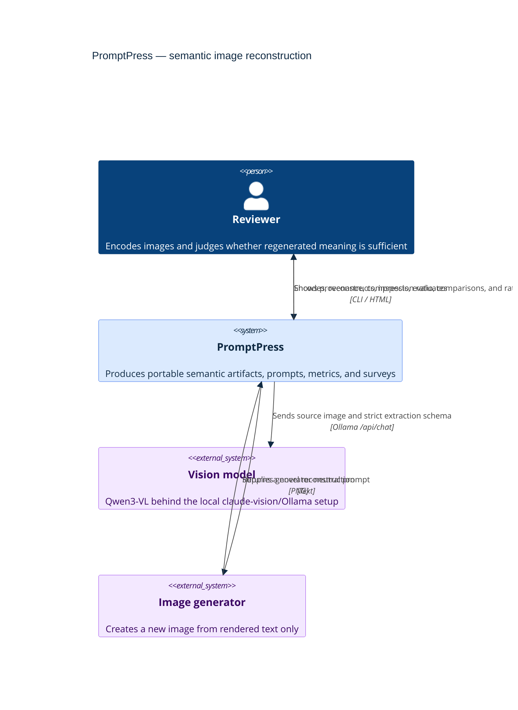
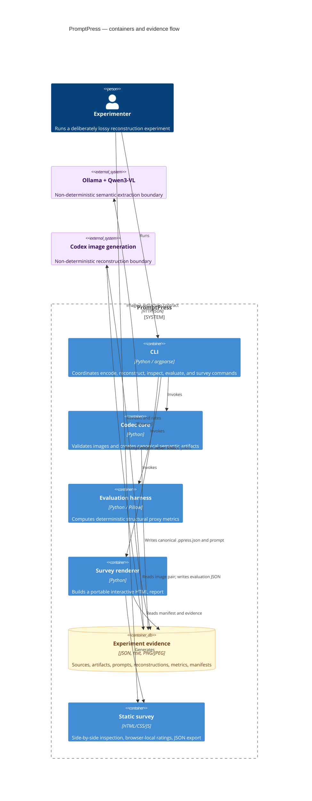
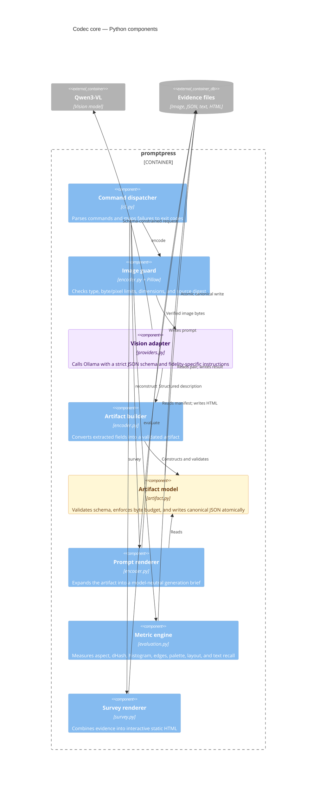
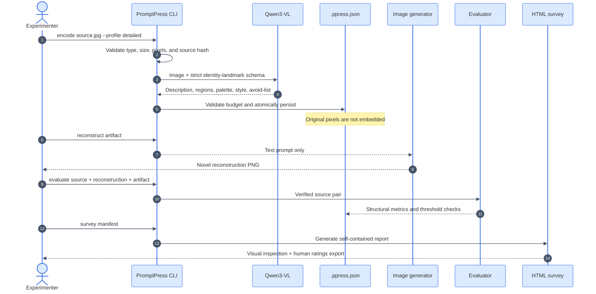

# PromptPress architecture

> **Architecture goal:** exchange exact pixels for a compact, inspectable semantic artifact while
> making that irreversible loss explicit and measurable.

The diagrams use the [C4 model](https://c4model.com/) from system context down to components. Blue
elements are PromptPress, purple elements are models outside its deterministic core, and amber
elements are durable evidence.

## 1. System context

## 2. Containers and trust boundaries

The model calls are trust boundaries: provenance records their configuration, but PromptPress
cannot make their outputs deterministic. Everything after extraction—validation, canonical JSON,
budgets, prompt rendering, proxy evaluation, and HTML rendering—is local and testable.

## 3. Codec components

## 4. Reconstruction lifecycle

## Architectural consequences

| Property | What the architecture guarantees | What it cannot guarantee |
| --- | --- | --- |
| Portability | Artifact and rendered prompt are plain UTF-8 JSON/text | Future models interpret the prompt identically |
| Reproducibility | Source hash, dimensions, profile, model, seed, and temperature are recorded | A generator recreates identical pixels or identity |
| Safety | Inputs are bounded; artifacts validate; writes are atomic; source is never deleted | A prompt captures every visually important detail |
| Evaluation | Deterministic metrics expose coarse structural drift; HTML collects human judgment | Proxy scores equal perceptual or identity similarity |
| Compression | Stored artifacts remain far smaller than source photographs | Regenerated PNGs, model weights, and compute are free |

The central design choice is intentional: **the `.ppress.json` artifact is a semantic memory, not a
compressed photograph**. The detailed profile spends more bytes on identity landmarks, but any
feature absent from that artifact is irrecoverably replaced by the generator's prior.
