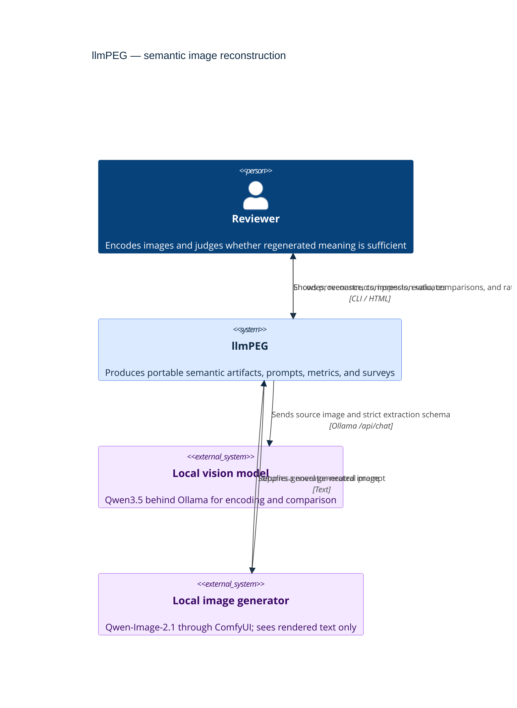
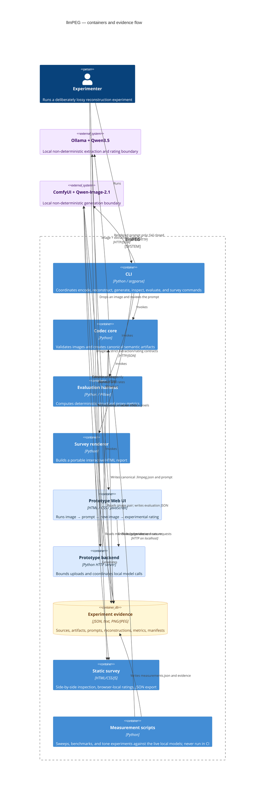
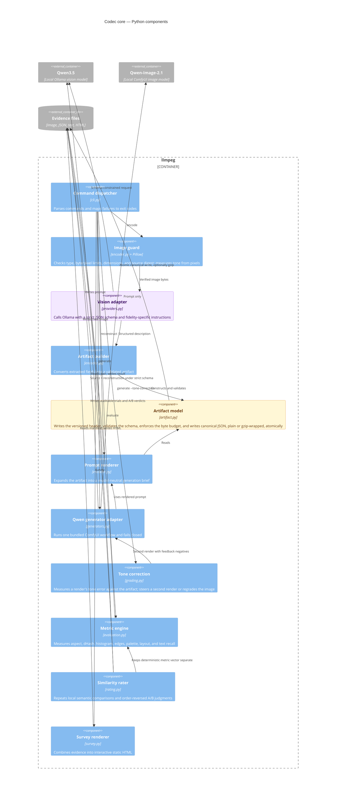
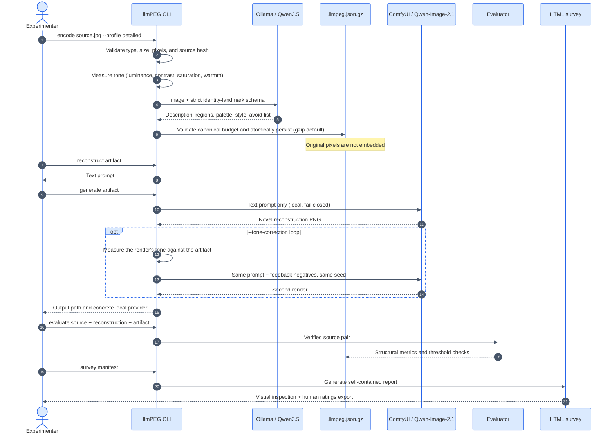

# llmPEG architecture

> **Architecture goal:** exchange exact pixels for a compact, inspectable semantic artifact while
> making that irreversible loss explicit and measurable.

The diagrams use the [C4 model](https://c4model.com/) from system context down to components. Blue
elements are llmPEG, purple elements are models outside its deterministic core, and amber
elements are durable evidence.

Both models run locally: Qwen3.5 (`qwen3.5:4b`) behind Ollama encodes, and Qwen-Image-2.1 behind
ComfyUI generates. Early experiments used a remote `qwen3-vl:32b` endpoint and hosted image
generators (Codex's built-in tool, briefly others); those adapters are gone, and only their
labelled evidence remains under `survey/`.

## 1. System context

## 2. Containers and trust boundaries

The model calls are trust boundaries: provenance records the encoder configuration, but llmPEG
cannot make model output deterministic. The prototype sends a bounded copy to local Ollama and
only the resulting editable prompt to local ComfyUI. Its rating step sends source and generated
images to Ollama, never to the generator. Validation, canonical JSON, budgets, prompt rendering,
proxy evaluation, and HTML rendering are local and testable.

## 3. Codec components

## 4. CLI reconstruction lifecycle

The CLI's `generate` command has one path: direct local ComfyUI HTTP with the bundled
Qwen-Image-2.1 workflow. Unreachable services, workflow errors, invalid images, and model-release
errors remain visible; no hosted fallback runs. The Web UI exposes the same adapter through
`/api/generate`. `/api/rate` combines unchanged deterministic metrics with three local semantic
trials; its result is explicitly uncalibrated. Ollama and ComfyUI release their models between
phases so the workloads can share an 8 GB GPU. The Web UI remains a localhost prototype, not a
hardened network service.

## Architectural consequences

| Property | What the architecture guarantees | What it cannot guarantee |
| --- | --- | --- |
| Portability | Artifact and rendered prompt are plain UTF-8 JSON/text; the optional gzip envelope opens with standard `gunzip` | Future models interpret the prompt identically |
| Reproducibility | Source hash, dimensions, profile, model, seed, and temperature are recorded; the same artifact, seed, and local setup render identical pixels | Identical pixels across machines, model versions, or settings; identity of the original subject |
| Safety | Inputs are bounded; artifacts validate; writes are atomic; source is never deleted | A prompt captures every visually important detail |
| Evaluation | Deterministic metrics, measured tone, repeat spread, raw semantic trials, and human survey exports remain separate and inspectable | Any automatic score equals human perceptual or identity similarity |
| Compression | Stored artifacts remain far smaller than source photographs | Regenerated PNGs, model weights, and compute are free |

The central design choice is intentional: **the `.llmpeg.json` artifact is a semantic memory, not a
compressed photograph**. The detailed profile spends more bytes on identity landmarks, but any
feature absent from that artifact is irrecoverably replaced by the generator's prior.
